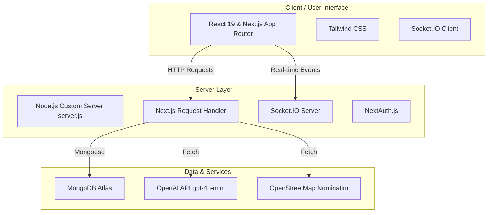
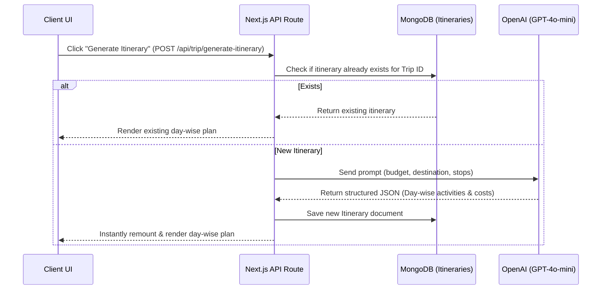

# Project Architecture — Travoii

Travoii is a full-stack, real-time collaborative travel planner built using Next.js, Socket.IO, Mongoose, and AI. Below is the technical architecture, project layout, and data flow design.

---

## 🏗️ Technology Stack



---

## 📂 Project Structure Map

Here is how the directories and core files align functionally:

```
travoii/
 ├── app/                             # Next.js App Router
 │    ├── api/                        # Backend REST Endpoints
 │    │    ├── auth/                  # NextAuth & Sign-up routes
 │    │    ├── location/              # Nominatim location search API
 │    │    └── trip/                  # Trip CRUD & Itinerary Generation APIs
 │    ├── create-trip/                # Form page to create a trip
 │    └── dashboard/                  # Core user interface & trips grid
 ├── components/                      # Reusable UI widgets
 │    ├── InviteBox.tsx               # Collaboration invitation inputs
 │    ├── ItineraryBox.tsx            # Renders day-by-day itineraries
 │    └── MembersList.tsx             # Shows members belonging to the trip
 ├── lib/                             # Core utilities and singletons
 │    ├── auth.ts                     # Authentication helper & NextAuth config
 │    ├── db.ts                       # Cached Mongoose database connection client
 │    ├── socketClient.ts             # Socket.IO client initialization
 │    └── useSocket.ts                # React hooks wrapping real-time events
 ├── models/                          # Mongoose ODM schemas & database models
 │    ├── User.ts                     # User sign-up profiles
 │    ├── Trip.ts                     # Trip details (budget, destination, stops)
 │    ├── Member.ts                   # Trip membership mappings & roles
 │    └── Itinerary.ts                # Day-by-day plan structure
 └── server.js                        # Main Entry Point (integrates HTTP server & Socket.IO)
```

---

## 🔄 Core Data Flows

### 1. Trip Creation & Location Search
* **Search**: The client queries `/api/location/search?q=...` as they type in the location input box. The server forwards this query to the public **OpenStreetMap Nominatim API**, formatting the returned results as standard location options.
* **Creation**: Submitting the form triggers a `POST` request to `/api/trip/create`. The route stores the trip parameters (title, budget, locations, stops) in MongoDB and maps the creator as the first `admin` member of the trip.

### 2. AI Itinerary Generation


### 3. Real-Time Socket Collaboration
When users are viewing the dashboard:
* **Connection**: The client initializes a WebSockets connection utilizing the helper [useSocket.ts](file:///e:/Travoii/lib/useSocket.ts) pointing to `/api/socket`.
* **Rooms**: The server places users into distinct rooms categorized by `tripId`.
* **Syncing**: When a user invites another member via [InviteBox.tsx](file:///e:/Travoii/components/InviteBox.tsx), it fires a server action which emits a Socket.IO event. Other clients joined in the same `tripId` room instantly receive the event and refresh their member list automatically.

---

## 🗄️ Database Schema Design

* **User**: Stores email, name, and hashed passwords.
* **Trip**: Holds trip details including arrays of `stops` and a reference to the `createdBy` user.
* **Member**: Bridges users and trips. Assigns roles (`admin`, `member`) and tracks members via `userEmail` and `tripId`.
* **Itinerary**: Maps to a specific `tripId`. Houses nested arrays representing `days`, which contain `activities` and the corresponding `estimatedCost`.
